# Purplexity Brand Guidelines

Branding for the Purplexity homelab: logos, wordmark, lockup, mascot, colors, and light and dark backdrops for the SSO login page.

| Light theme | Dark theme |
|---|---|
| 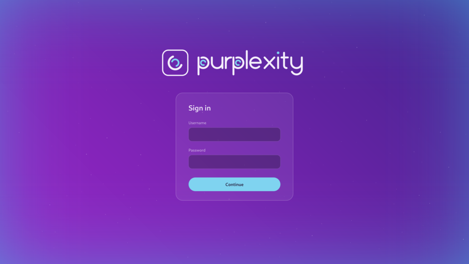 | 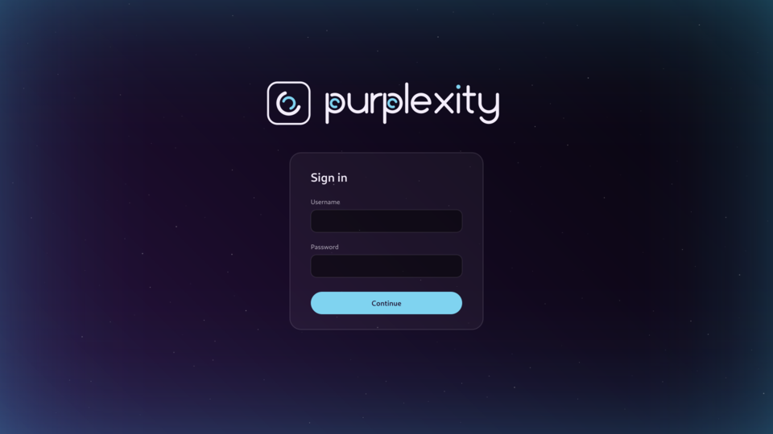 |

---

## Files and formats

Every asset comes in **SVG, PNG, JPG and WebP**.

| Format | Background | Use for |
|---|---|---|
| **SVG** | Transparent | Websites, and scaling to any size. This is the source file. |
| **PNG** | Transparent | Anywhere SVG isn't accepted and you need transparency |
| **WebP** | Transparent | Websites, smallest files |
| **JPG** | Solid JPG Matte `#6F23AB`; Night Mid `#130920` for dark versions; white for black and black-with-blue versions (JPG can't be transparent) | Places that only take JPG |

Pixel sizes of the PNG, JPG and WebP versions:

| Asset | Size |
|---|---|
| Logos, icons, mascot | 1024 × 1024 |
| Wordmark | 2160 × 600 |
| Lockup | 2760 × 600 |
| Backdrops | 3840 × 2160 |
| Login examples | 1920 × 1080 |

### Repository structure

```
purplexity-branding/
├── index.html       website front page: browse and copy links to every asset
├── README.md        these guidelines
├── assets/
│   ├── svg/         every asset as .svg
│   ├── png/         every asset as .png
│   ├── jpg/         every asset as .jpg
│   ├── webp/        every asset as .webp
│   └── css/         authentik.css: login page theme for authentik
└── guidelines/      preview images used in this README
```

| Asset | File names |
|---|---|
| Logo | `logo-outline` (+ `-purple`, `-dark`, `-black`, `-black-blue`), `logo-tile` |
| Icons | `icon-purple`, `icon-dark` |
| Wordmark | `wordmark` (+ `-black`, `-black-blue`) |
| Lockup | `lockup` (+ `-black`, `-black-blue`) |
| Mascot | `mascot`, `mascot-tile`, `mascot-icon-purple`, `mascot-icon-dark` |
| Backdrops | `backdrop-light`, `backdrop-dark` |
| Login examples | `login-light`, `login-dark` |

Every name exists in all four format folders: `assets/<format>/<name>.<format>`.

### Versions

Files in `assets/<format>/` are version 1 and **never change**, so links to them keep working forever.

When an asset changes, the new file goes in a version folder with the **same file name**:

```
assets/png/logo-outline.png       version 1
assets/png/v2/logo-outline.png    version 2
assets/png/v3/logo-outline.png    version 3
```

A version folder only holds the files that changed in that version.

### Using the files as a CDN

The repository is a static website on GitHub Pages. The front page, [loserpurp.github.io/purplexity-branding](https://loserpurp.github.io/purplexity-branding/), shows every asset with download links, and every file can be linked directly:

```
https://loserpurp.github.io/purplexity-branding/assets/<format>/<name>.<format>
https://loserpurp.github.io/purplexity-branding/assets/<format>/v2/<name>.<format>
```

For example:

```html

```

```css
body {
  background: #130920 url("https://loserpurp.github.io/purplexity-branding/assets/webp/backdrop-dark.webp") center / cover no-repeat;
}
```

---

## Logo

The mark is the **double arc**: an outer arc and an inner arc that open in opposite directions.

### Main logo · `logo-outline`

A rounded-square border with the double arc inside: border and outer arc in Lilac White, inner arc in Arc Blue. It comes in three versions:

| Version | File | Background inside the border | Use on |
|---|---|---|---|
| Transparent | `logo-outline` | None | Either backdrop, dark surfaces |
| Purple | `logo-outline-purple` | Tile gradient `#9E12DA → #44139F` | Anywhere, including white and light backgrounds |
| Dark | `logo-outline-dark` | Night gradient `#2B1343 → #07050D` | Anywhere, including white and light backgrounds |

On the light backdrop:

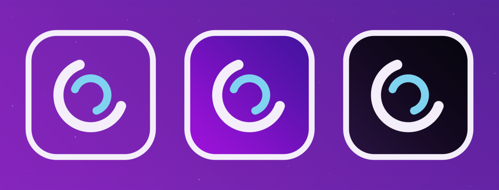

On the dark backdrop:

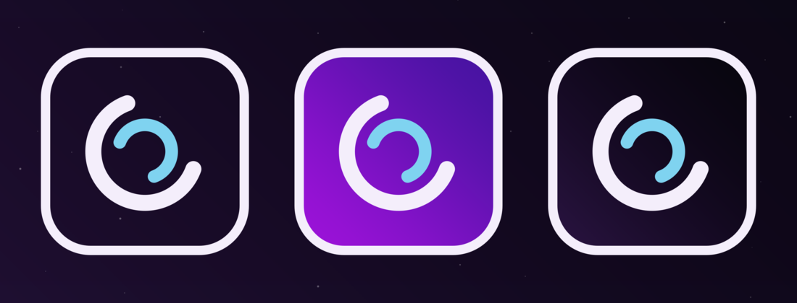

On white (purple and dark versions only):

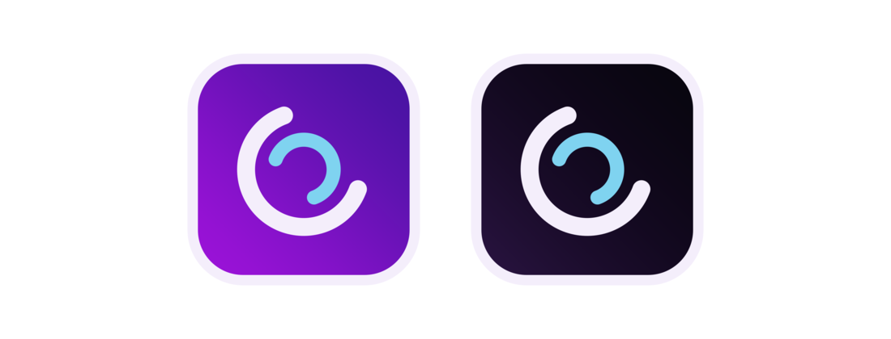

Both gradients run at 45°, lighter at the bottom-left. The JPG of the dark version sits on Night Mid `#130920` instead of the usual JPG Matte.

### Alternative logo: tile · `logo-tile`

| On light | On dark |
|---|---|
| 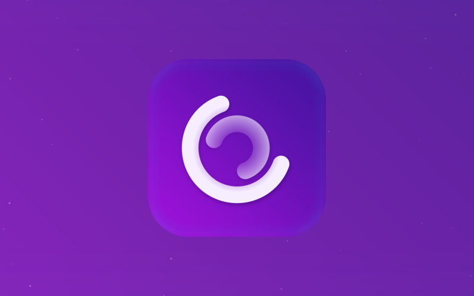 | 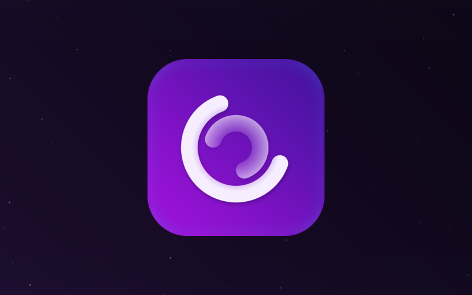 |

A rounded-square tile with a 45° purple gradient, a faint blue inner glow, and the double arc in Mark White. The middle of the mark fades to transparent.

Use it where a softer, glowing app-icon look fits better.

> The fade uses an SVG mask. Browsers support it, but some image viewers skip it and show the middle as solid white. Use the PNG or WebP when you need a guaranteed look.

### Sizes

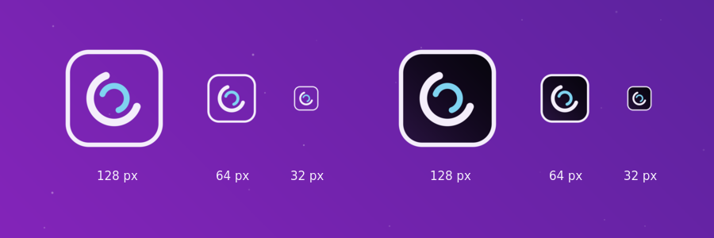

All logo versions stay readable down to **32 px**. Below that, the inner arc starts to fill in.

### Clear space

Keep empty space around the logo equal to **at least 25% of the logo's width** on every side.

---

## Wordmark · `wordmark`

| On light | On dark |
|---|---|
| 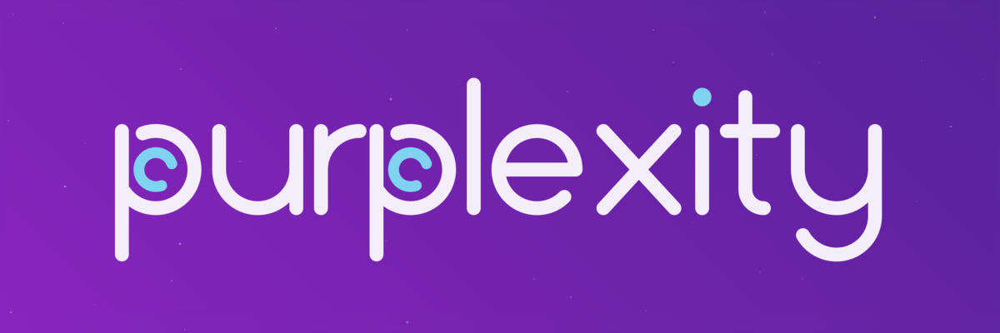 | 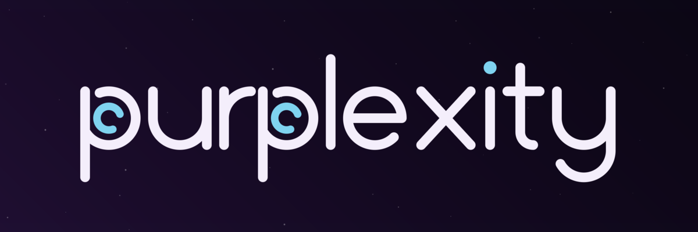 |

Custom lowercase letters drawn with an even monoline stroke and rounded ends. Both **p** bowls carry the double arc, and the **i** has an Arc Blue dot.

- Letters: Lilac White `#F4EEFB`
- Accents (p inner arcs, i dot): Arc Blue `#7FD3F0`
- Always lowercase: **purplexity**
- The wordmark is a drawing, not a font. Don't retype the name in another typeface.

---

## Lockup · `lockup`

| On light | On dark |
|---|---|
| 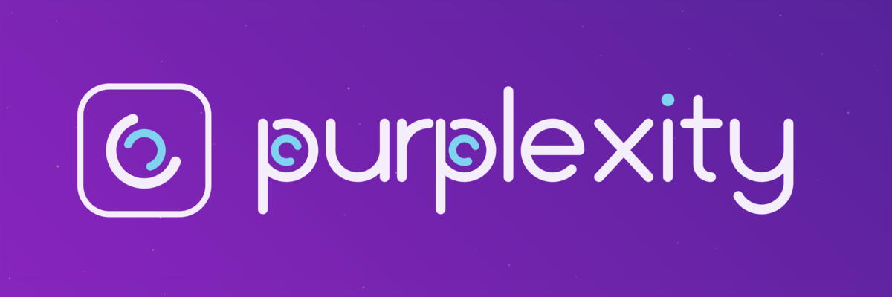 | 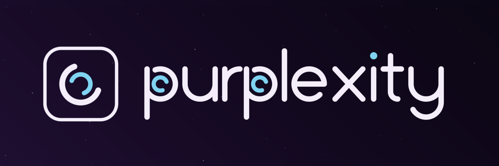 |

Outline logo on the left, wordmark on the right.

- The logo is about 2.6× the wordmark's x-height and centered on the x-height, so the arc weight matches the letter weight.
- The gap between logo and wordmark is about 30% of the logo's height.
- Use the lockup as the header of the login page.

---

## Mascot

### Transparent · `mascot`

| On light | On dark |
|---|---|
| 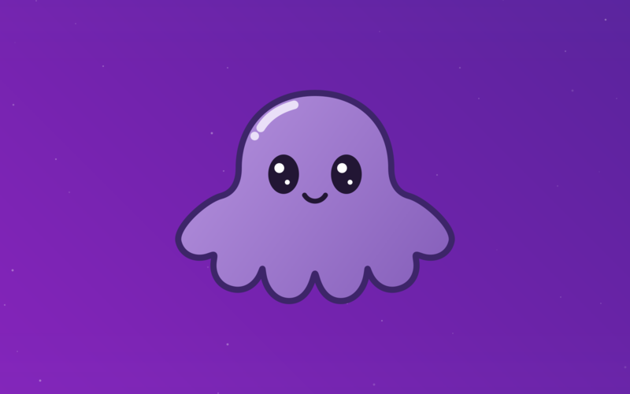 |  |

### Tile · `mascot-tile`

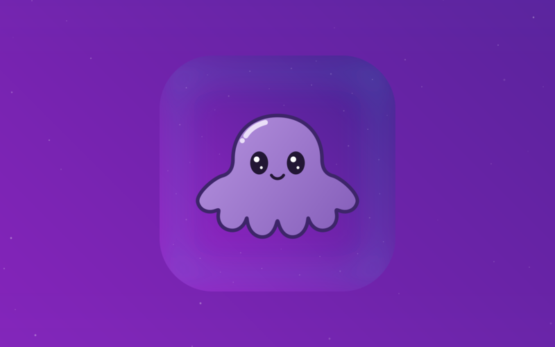

A cute octopus with a glossy dome head, a scalloped skirt of tentacles, big sparkly eyes and a small smile. The tile version sits on a starry purple tile with a long blue inner glow.

Use the mascot for friendly moments: empty states, error and 404 pages, loading screens. Keep the logo for identity.

---

## Icons

### Mascot icons · `mascot-icon-purple`, `mascot-icon-dark`

The octopus at 72% size inside the main logo's Lilac White border, on the purple or the dark gradient. Use it for the light and dark theme versions of app icons, avatars and favicons that should feel friendly.

| On light backdrop | On dark backdrop | On white |
|---|---|---|
| 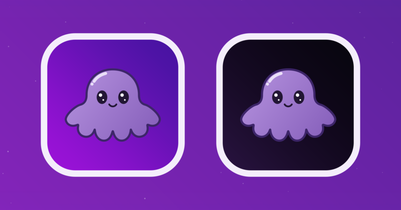 | 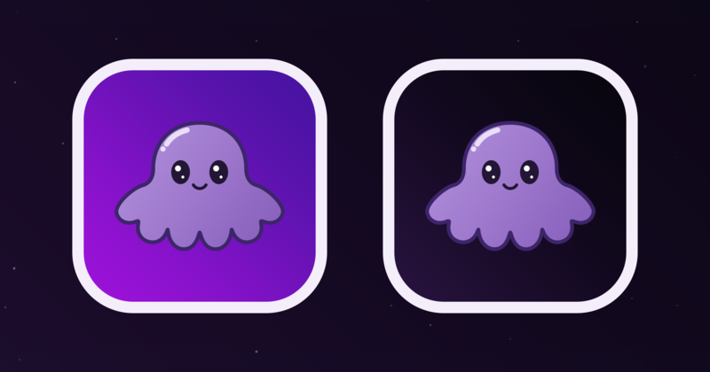 | 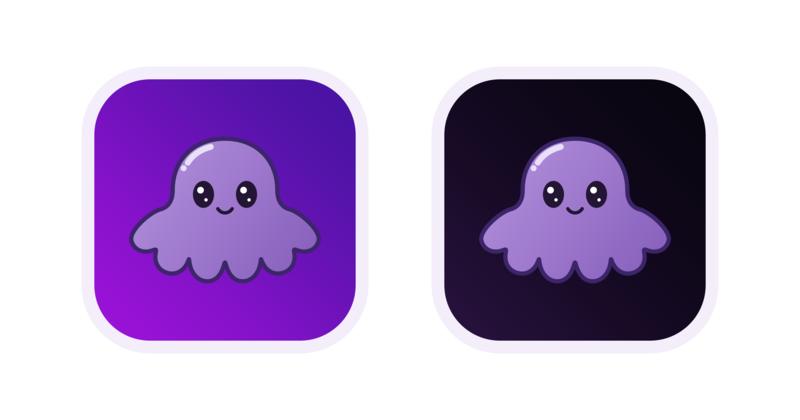 |

### Blank icons · `icon-purple`, `icon-dark`

Just the gradient and the border, with nothing inside. Use it as a base when making icons for other services in the homelab, so they all share the same frame.

| On light backdrop | On dark backdrop |
|---|---|
| 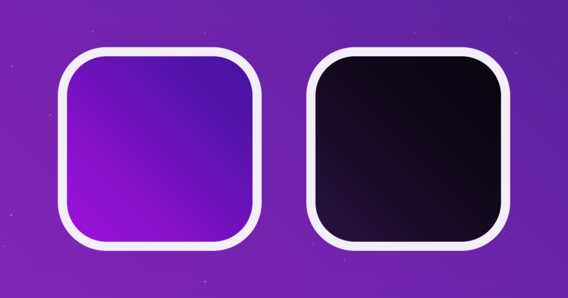 | 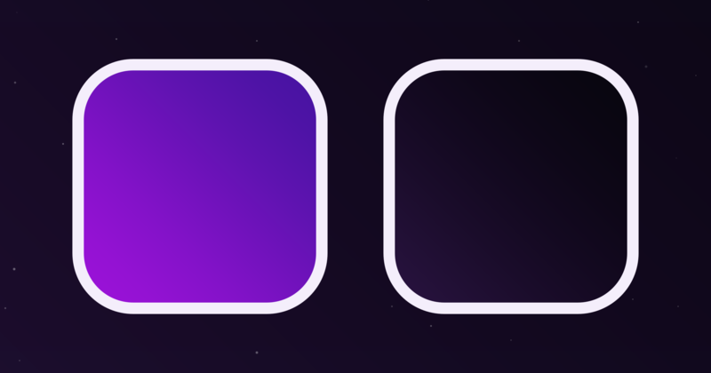 |

Both icon sets use the same gradients as the main logo:

- Purple: Tile Bright `#9E12DA` → Tile Deep `#44139F`
- Dark: Night Purple `#2B1343` → Night Black `#07050D`

---

## Black versions · `logo-outline-black`, `wordmark-black`, `lockup-black`

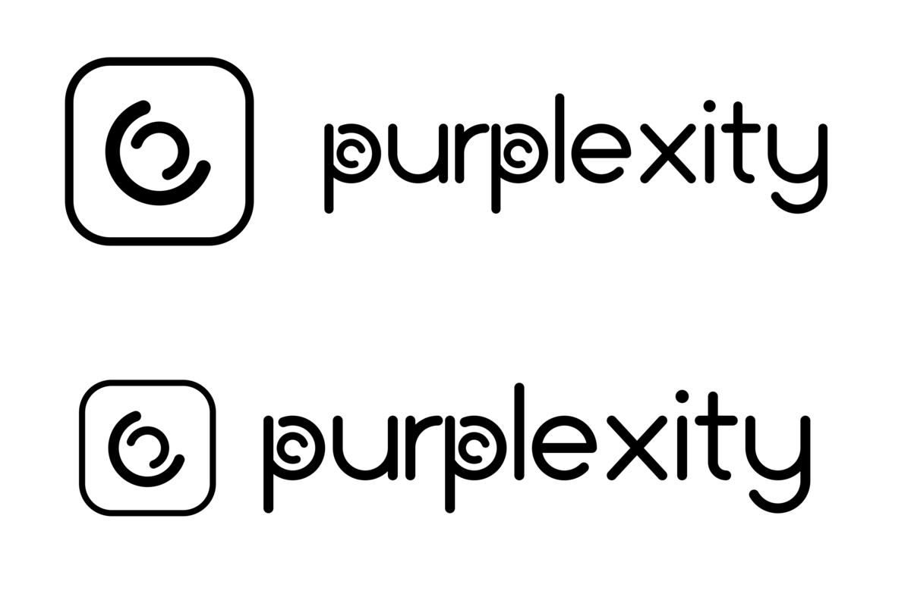

The transparent main logo, the wordmark and the lockup with every color turned pure black `#000000`, including the blue accents.

Use them where only one color can be used (printing, stamps, engraving). For normal use on light backgrounds, prefer the black with blue versions. Their JPGs sit on white.

---

## Black with blue versions · `logo-outline-black-blue`, `wordmark-black-blue`, `lockup-black-blue`

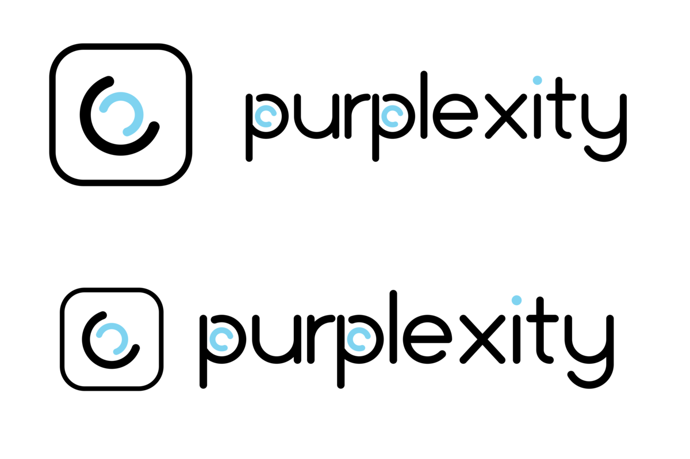

The same as the black versions, but the accents stay Arc Blue `#7FD3F0`: the inner arc of the logo, the inner arcs of both **p**s, and the dot on the **i**.

This is the preferred set on white or light backgrounds. Use the all-black versions only where a single color is required. Their JPGs sit on white.

---

## Backdrops

| Light · `backdrop-light` | Dark · `backdrop-dark` |
|---|---|
| 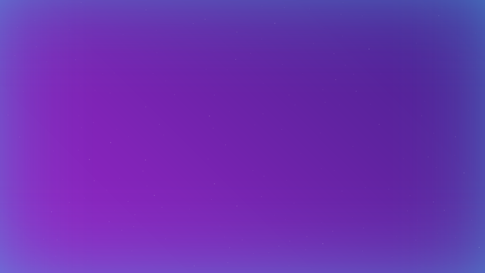 | 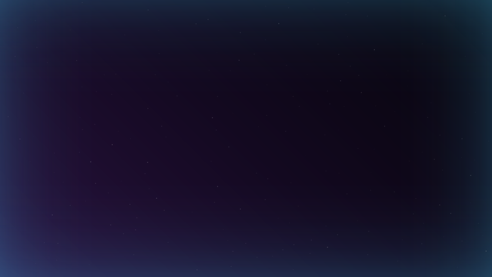 |

Both use a true 45° gradient (lighter bottom-left, deeper top-right), a long soft blue glow coming in from every edge, and about 190 faint translucent stars in the same positions.

| | Light | Dark |
|---|---|---|
| Gradient | Backdrop Bright `#9626C6` → Backdrop Deep `#482191` | Night Purple `#2B1343` → Night Black `#07050D` |
| Edge glow | Backdrop Glow `#41B8E4`, up to 26% | Backdrop Glow `#41B8E4`, up to 18% |
| Solid fallback | `#6F23AB` | `#130920` |

```css
/* light */
body { background: #6F23AB url("backdrop-light.webp") center / cover no-repeat; }

/* dark */
body { background: #130920 url("backdrop-dark.webp") center / cover no-repeat; }

/* follow the visitor's system setting */
@media (prefers-color-scheme: dark) {
  body { background: #130920 url("backdrop-dark.webp") center / cover no-repeat; }
}
```

---

## Colors

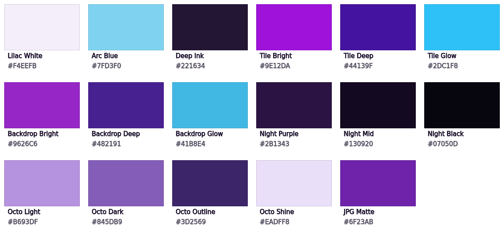

### Core

| Name | Hex | RGB | Use |
|---|---|---|---|
| Lilac White | `#F4EEFB` | 244, 238, 251 | Wordmark letters, outline logo, text |
| Arc Blue | `#7FD3F0` | 127, 211, 240 | Inner arc, i dot, primary buttons |
| Deep Ink | `#221634` | 34, 22, 52 | Text on Arc Blue, light theme inputs, mascot eyes |

### Logo tile

| Name | Hex | RGB | Use |
|---|---|---|---|
| Tile Bright | `#9E12DA` | 158, 18, 218 | Gradient start, bottom-left |
| Tile Deep | `#44139F` | 68, 19, 159 | Gradient end, top-right |
| Tile Glow | `#2DC1F8` | 45, 193, 248 | Inner edge glow at 14% |
| Mark White | `#F6EEFF` | 246, 238, 255 | Double arc on the tile |

### Light theme

| Name | Hex | RGB | Use |
|---|---|---|---|
| Backdrop Bright | `#9626C6` | 150, 38, 198 | Gradient start, bottom-left |
| Backdrop Deep | `#482191` | 72, 33, 145 | Gradient end, top-right |
| Backdrop Glow | `#41B8E4` | 65, 184, 228 | Edge glow |
| JPG Matte | `#6F23AB` | 111, 35, 171 | Background of JPG exports, light fallback color |

### Dark theme

| Name | Hex | RGB | Use |
|---|---|---|---|
| Night Purple | `#2B1343` | 43, 19, 67 | Gradient start, bottom-left |
| Night Mid | `#130920` | 19, 9, 32 | Middle of the gradient, dark fallback color |
| Night Black | `#07050D` | 7, 5, 13 | Gradient end, top-right, the main dark color |

### Mascot

| Name | Hex | RGB | Use |
|---|---|---|---|
| Octo Light | `#B693DF` | 182, 147, 223 | Body gradient start |
| Octo Dark | `#845DB9` | 132, 93, 185 | Body gradient end |
| Octo Outline | `#3D2569` | 61, 37, 105 | Body outline |
| Octo Shine | `#EADFF8` | 234, 223, 248 | Highlight on the head |
| Deep Ink | `#221634` | 34, 22, 52 | Eyes and smile |

### Rules

- Gradients run at **45°: lighter at the bottom-left, deeper at the top-right.**
- Stars are pure white at 10–38% opacity.

---

## Typography

- **Brand name:** always use the wordmark artwork, never typed text.
- **Interface text** (login form, labels, buttons): a clean sans-serif such as Inter, falling back to the system UI font.
  - Headings: 600 weight, Lilac White
  - Labels: 400 weight, Lilac White at 75%
  - Button text: 600 weight, Deep Ink on Arc Blue

---

## Login page · `login-light`, `login-dark`

| Light | Dark |
|---|---|
|  |  |

| Element | Light theme | Dark theme |
|---|---|---|
| Background | Light backdrop | Dark backdrop |
| Header | Lockup, centered | Lockup, centered |
| Card | Lilac White 8% fill, 22% border, 28 px radius | Lilac White 5% fill, 14% border, 28 px radius |
| Inputs | Deep Ink 35%, Lilac White 18% border, 14 px radius | Black 45%, Lilac White 18% border, 14 px radius |
| Button | Arc Blue pill, Deep Ink text | Arc Blue pill, Deep Ink text |

The logo, wordmark, lockup and button colors stay the same in both themes. Only the backdrop and the card change.

---

## Authentik theme · `assets/css/v5/authentik.css`

Custom CSS that makes the authentik login page match the login examples above: the backdrop follows authentik's light or dark theme, the lockup floats above a glass card, inputs are rounded, and the primary button is an Arc Blue pill.

It also styles the user interface: on the Application Dashboard the backdrop replaces the grey background and application tiles become glass cards with an Arc Blue hover; the settings pages get the same glass cards, a highlighted tab rail, transparent tables and pill buttons.

To use it, open the file, copy **all of its contents**, and paste them into **Admin → System → Brands → (your brand) → Custom CSS**:

```
https://branding.purplexity.no/assets/css/v5/authentik.css
```

> Don't use `@import url(...)` to load the file. authentik adds brand CSS to each component's shadow root in a way that doesn't allow `@import`, so only the backdrop would change and the card, inputs and button would keep authentik's default look. Paste the full CSS instead, and paste it again when the file changes.

- authentik applies brand CSS to every interface, so every rule is scoped to the login flow or the user interface. The admin interface keeps authentik's normal look.
- Set the brand logo to `assets/svg/lockup.svg` and the favicon to `assets/svg/logo-outline-purple.svg`.
- Tested on the username and password step in Chrome and Firefox, desktop and phone, light and dark.
- The loading state after pressing **Log in** has no dark box: the card fades slightly and an Arc Blue spinner shows over it.
- Like the images, the CSS follows the version rule:

| Version | File | Change |
|---|---|---|
| 1 | `assets/css/authentik.css` | First theme |
| 2 | `assets/css/v2/authentik.css` | Replaces the dark loading box with a faded card and an Arc Blue spinner |
| 3 | `assets/css/v3/authentik.css` | Error, warning and info alerts in the card get a soft glass style |
| 4 | `assets/css/v4/authentik.css` | Styles the user interface's Application Dashboard |
| 5 | `assets/css/v5/authentik.css` | Styles the user interface's settings pages **(current)** |

---

## Do and don't

**Do**
- Put the transparent logo, wordmark and lockup on either backdrop or another dark surface
- Use the purple or dark logo version on white and light backgrounds
- Keep the outer arc Lilac White and the inner arc Arc Blue
- Scale logos proportionally
- Save changes as a new version file

**Don't**
- Put the white transparent logo, wordmark or lockup on white or light backgrounds (they disappear). Use the black with blue versions there instead.
- Recolor the arcs, or swap which arc is blue
- Stretch, rotate or skew any logo
- Add shadows or glows to the main logo, wordmark or lockup
- Rebuild the wordmark with a regular font
